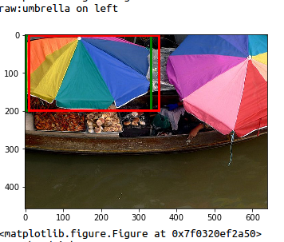

### NLOD:(Natural language object decetion)

### Requiremnt
#### software
- python2.7
- opencv python for image read,transform and resize
- gensim:for word2vec loading
- lastest mxnet（0.9.3 or higher）,which support mx.RNN
#### hardware  
Thanks for the amazing feature of mxnet,a GPU with 6GB memory is enough
#### training
- download pre-trained ImageNet Model [VGG](http://data.dmlc.ml/mxnet/models/imagenet/vgg/vgg16-0000.params) or [Resnet-101](http://data.dmlc.ml/mxnet/models/imagenet/resnet/101-layers/resnet-101-0000.params) and put it in `/model` folder.Or your can use `script/get_pretrained_model.sh`
- download dataset [refer](https://github.com/lichengunc/refer) refcoco version and upzip it,put it in `data` folder.
- download the mscoco(http://mscoco.org/) dataset,use `scrpt/get_coco.sh`,after successfully download it,create a symbol link use follow code(which will saves the disk space):
```
	cd ./data/images/
	ln -s mscoco YourPathtoMSCOCO train2014 image
```
- download the pre-trained Facebook word2vec model
- uhhh. so many data for download,I'll write a script for easy usage (:
- run `make` in root folder,this will make some cython functions for RCNN and tookits of mscoco
- `python train_end2end.py`

### Testing
- `python test.py`, the test output will write to `data/cache/decetion.pkl`file.  

### Result
I list some good and not good result as follow(red rectangle is what the model predicted,gredd rectangle is the ground truth)：



## working project  
There were some technologies that may improve my model.I've add it to the working project.shown as below:  
- [x] Use [ROIAlign](https://arxiv.org/pdf/1703.06870.pdf) instead of RoIPooling(cpu farward and backward was implemented,I'm working on the GPU code)
- encode sentences using CNN,which seems more effcient for short text.
- dilation CNN to get image feature.
- add a demo,I think a onlie domo is needed.


## Reference and acknowlegement
This implement was 90% base one the [mxent-faster-rcnn](https://github.com/dmlc/mxnet/tree/master/example/rcnn),thanks to this fast and concise implement.
